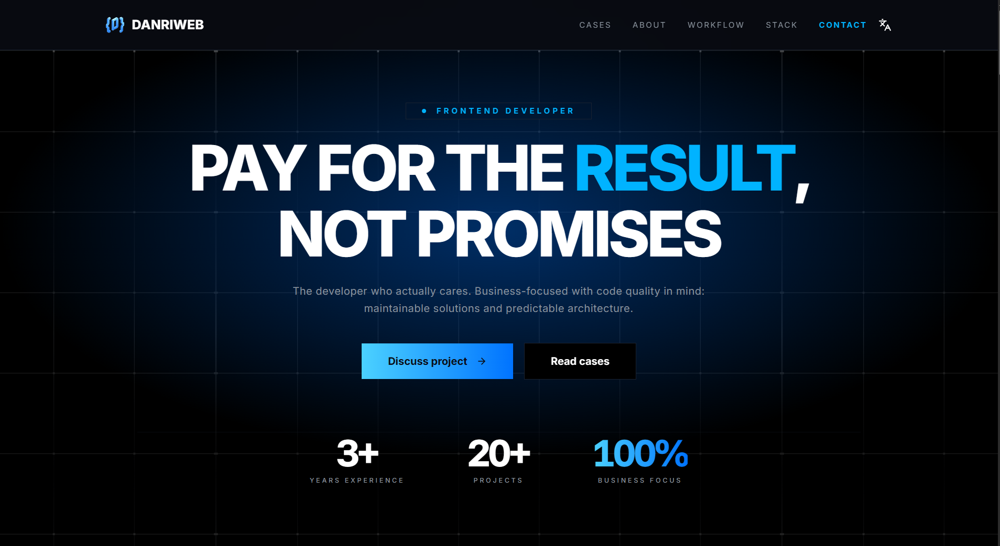

# DanriWeb | Современное персональное портфолио

🇷🇺 **Русский** | [🇺🇸 English](README.en.md)

**Live:** [https://danri-web.ru/ru](https://danri-web.ru/ru)

Это мое персональное веб-портфолио, созданное для демонстрации не только проектов, но и моего комплексного подхода к современной frontend-разработке. Главной целью было создать высокооптимизированное, доступное (a11y) и production-ready приложение, а не просто красивую статичную визитку.

## Ключевые особенности

- **Глубокая доступность (a11y):** Строгая семантическая HTML-разметка, полная поддержка навигации с клавиатуры, удержание фокуса (focus-traps) в модалках и оптимизация для скринридеров (включая скрытие декоративных бейджей через `aria-hidden`).
- **Продвинутая i18n (5 языков):** Поддержка русского, английского, немецкого, японского и корейского языков. Включает адаптивную подгрузку специфичных шрифтов (например, `Noto Sans JP` и `KR`) и локализованные правила переноса строк.
- **Фокус на производительности:** Гибридный рендеринг (SSG) для молниеносной первоначальной загрузки, lazy-loading тяжелого контента и использование Next.js Middleware для мгновенной маршрутизации локалей.
- **Масштабируемая архитектура:** Кодовая база строго следует методологии **Feature-Sliced Design (FSD)**, что гарантирует изолированность слоев, чистоту кода и простоту поддержки.
- **Свой CI/CD Pipeline:** Приложение полностью докеризовано. Автодеплой на VPS автоматизирован через GitHub Actions с выгрузкой готовых образов в GHCR.

## Внутренняя документация

Чтобы поддержать масштабируемость и строгие стандарты кода, я вынес описание всех соглашений в отдельную документацию. Она также помогает лучше понять мой технический стиль:

- [🔗 Архитектура и слои FSD](./docs/architecture.md)
- [🔗 Стандарты кода и нейминг](./docs/conventions.md)
- [🔗 Правила React-компонентов и UI](./docs/components.md)
- [🔗 Управление состоянием (Zustand)](./docs/state-management.md)

## Технологический стек

- **Core:** Next.js 16 (App Router), React 19, TypeScript (`strict: true`)
- **Стилизация:** Tailwind CSS v4, Shadcn UI
- **Анимации:** Framer Motion
- **Локализация:** next-intl
- **Стейт-менеджмент:** Zustand
- **Формы и валидация:** React Hook Form + Zod
- **Качество кода:** ESLint, Prettier, Steiger (линтер архитектуры FSD)
- **Деплой:** Docker, GitHub Actions, GHCR
